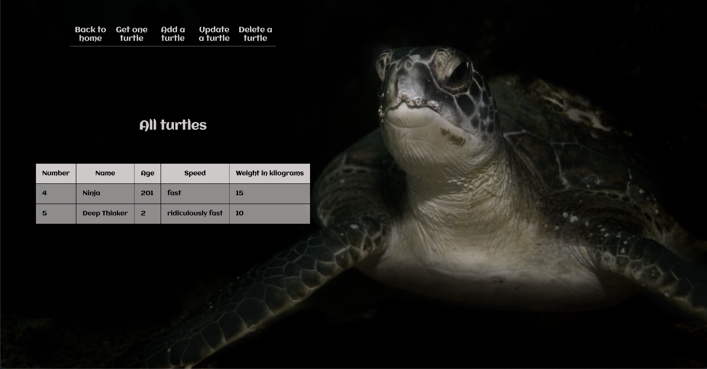
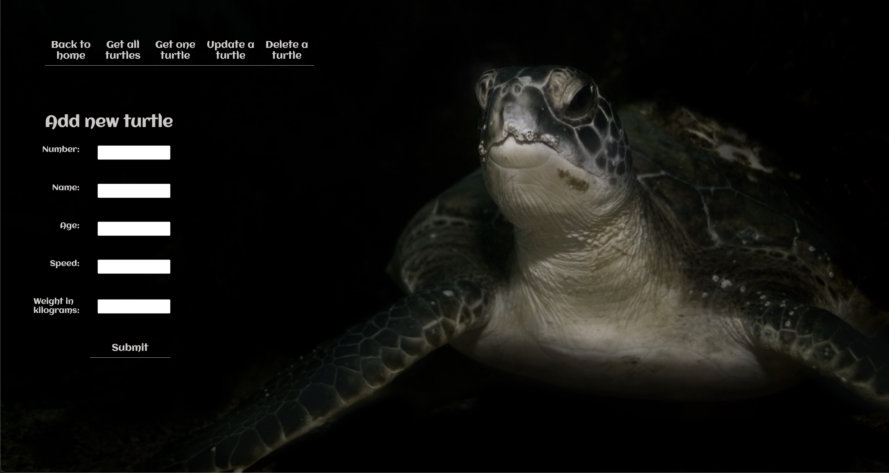
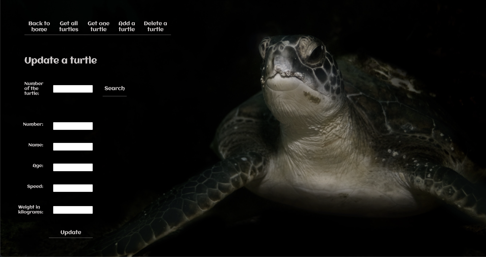
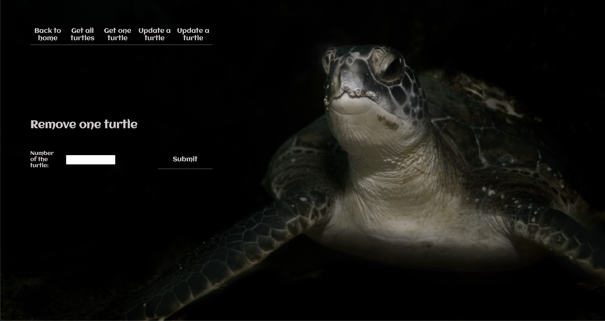

# Turtle database

This is Business College school assigment. Two servers build with Express. Another one for database with mysql/mariadb and another for the app using the database. CSS is all my design.

## Usage

When you pulled all your files to a your local machine:

- Go to folder "databaseBackend" and open terminal to run command npm run build
- After that run command npm install
- Go to "SPA" folder and open termninal to run command npm install.
- In both termminals run npm start
- Go to localhost: 3000 on your browser

## Pictures

Landing page photo by Karl Ibri https://unsplash.com/@karlibri?utm_source=unsplash&utm_medium=referral&utm_content=creditCopyText

All turtles photo by Will Turner https://unsplash.com/@turner_imagery?utm_source=unsplash&utm_medium=referral&utm_content=creditCopyText

## Screenshots

